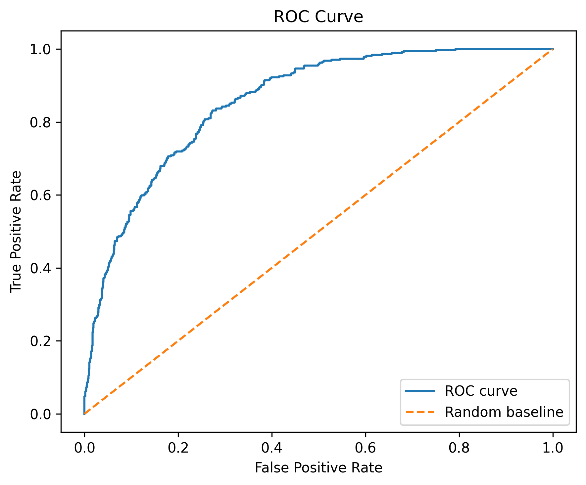

# Customer Churn Prediction + Retention Targeting (Telco)

Predict customer churn and turn model scores into actionable retention targeting strategies.

This project builds an end-to-end churn pipeline (**cleaning → encoding → train/val/test split → model training → evaluation**) and compares **Logistic Regression** vs **XGBoost** using **ROC-AUC** and **PR-AUC**, then evaluates practical threshold policies for retention outreach.

---

## TL;DR Results (Test Set)

### Model Comparison

| Model | ROC-AUC | PR-AUC | Summary |
|---|---:|---:|---|
| Logistic Regression (baseline) | **0.8498** | **0.6461** | Strong interpretable baseline |
| Logistic Regression (tuned) | 0.8494 | 0.6453 | Similar/slightly worse than baseline |
| **XGBoost (tuned)** | **0.8562** | **0.6744** | **Best overall performance** |

### Final Model Selection
**Selected model: XGBoost (tuned)**

- Best **PR-AUC** (important for imbalanced churn prediction)
- Best **ROC-AUC**
- Better ranking quality for retention targeting

### Improvement vs Logistic Baseline
- **ROC-AUC:** +0.0064
- **PR-AUC:** +0.0282

> PR-AUC is emphasized because churn is an imbalanced classification problem, so it is more informative than accuracy alone for identifying actual churners.

---

## Test Curves (Final Model)




---

## Practical Operating Points (XGBoost Tuned, Test Set)

The final model outputs churn probabilities. Different thresholds support different retention team capacities and goals.

| Policy | Threshold | Target Rate | Precision | Recall | F1 |
|---|---:|---:|---:|---:|---:|
| Default threshold | 0.5000 | 21.58% | 0.6711 | 0.5455 | 0.6018 |
| Top 10% highest-risk customers | 0.6648 | 10.01% | **0.7730** | 0.2914 | 0.4233 |
| Best F1 threshold (selected on validation set) | 0.3910 | 30.94% | 0.5894 | **0.6872** | **0.6346** |

### Confusion Matrices (XGBoost Tuned, Test Set)
- **Threshold = 0.50** → `[[935, 100], [170, 204]]`
- **Top 10% threshold** → `[[1003, 32], [265, 109]]`
- **Best F1 threshold** → `[[856, 179], [117, 257]]`

### Business Interpretation
- **Top 10% threshold** is useful when outreach capacity is limited (higher precision among contacted customers).
- **Best F1 threshold** is better when the team can contact more customers and wants a more balanced precision/recall tradeoff.
- **0.50 threshold** is a useful default benchmark, but not always the best operational policy.

---

## Dataset & Target

- **Dataset:** Telco Customer Churn
- **Target:** `Churn Value` (0/1)

This pipeline produces **23 encoded model features** after preprocessing.

---

## Data & Preprocessing

This project uses a consistent preprocessing pipeline for all models:

- **Target:** `Churn Value` (binary)
- **Features:** demographics, services, contract/billing info, and charges (including `Total Charges`)
- **Cleaning:** converts `Monthly Charges` / `Total Charges` to numeric; fills missing `Total Charges` with `0` when `Tenure Months == 0`
- **Encoding:** maps binary fields to `0/1` and one-hot encodes multi-class columns (`Internet Service`, `Contract`, `Payment Method`)
- **Splitting:** stratified train / validation / test split (reproducible random seed)
- **Scaling:** standardizes continuous features (`Tenure Months`, `Monthly Charges`, `Total Charges`) using **training-set statistics only** (applied to val/test to avoid leakage)

The data loader returns:
`X_train, y_train, X_val, y_val, X_test, y_test`

---

## Models

### Logistic Regression (Baseline + Tuned)
Used as an interpretable benchmark:
- fast and stable for tabular binary classification
- useful for coefficient-based churn driver analysis

### XGBoost (Tuned) — Final Model
Used to capture:
- nonlinear effects
- feature interactions
- more flexible decision boundaries than logistic regression

XGBoost achieved the best test performance on both **ROC-AUC** and **PR-AUC**.

---

## Interpretability Benchmark (Logistic Regression)

Even though **XGBoost** was selected as the final predictive model, logistic regression remains useful as an interpretable benchmark for directional insights.

Full coefficient summary (if generated):
- `results/variable_affect_churn.csv`

Key takeaway from the logistic benchmark:
- lower tenure and shorter contracts are strongly associated with higher churn risk
- some service/payment patterns (e.g., fiber optic, electronic check) are associated with higher churn risk
- support/security add-ons are associated with lower churn

---

## Saved Outputs

This project stores evaluation outputs in `results/`, including:

- `results/performance_metrics`  
  JSON metrics for:
  - logistic regression baseline
  - logistic regression tuned
  - xgboost tuned
  - threshold-based evaluations

Optional outputs (if generated):
- grid search CV result tables (`*.csv`)
- plots in `reports/figures/`
- coefficient summaries / feature analyses

> Note: `performance_metrics` currently stores JSON content without a `.json` extension.

---

## Project Structure
customer_churn_prediction/
├── data/
│   ├── .gitkeep
│   └── Telco_customer_churn.xlsx
├── reports/
│   ├── pr_curve.png
│   ├── roc_curve.png
│   └── .gitkeep
├── results/
│   ├── .gitkeep
│   ├── best_logisticreg_params
│   ├── best_xgboost_params
│   ├── performance_metrics
│   └── variable_affect_churn.csv
├── src/
│   ├── __pycache__/
│   ├── __init__.py
│   ├── config.py
│   ├── data_loading.py
│   ├── logisticreg_hyperparmtuning.py
│   ├── logisticreg_training_eval.py
│   ├── xgboost_hyperparamtuning.py
│   └── xgboost_training_eval.py
├── .gitignore
└── README.md

## How to Run

### 1) Install dependencies
```bash
pip install -r requirements.txt
