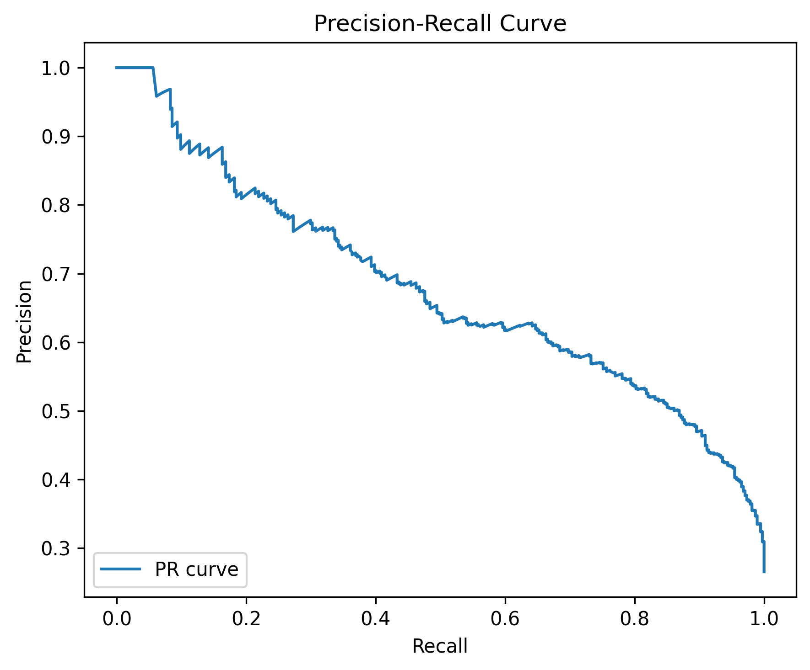
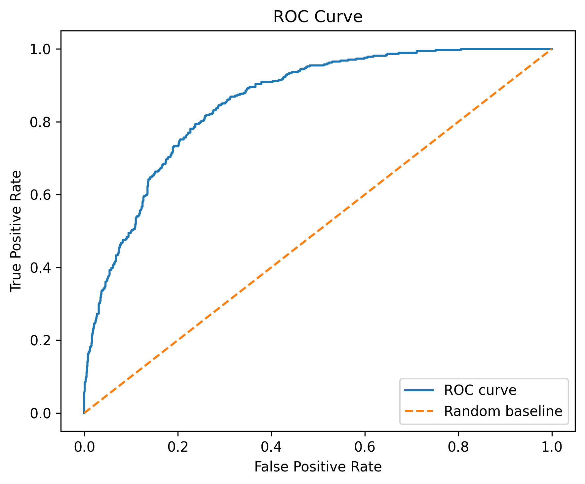
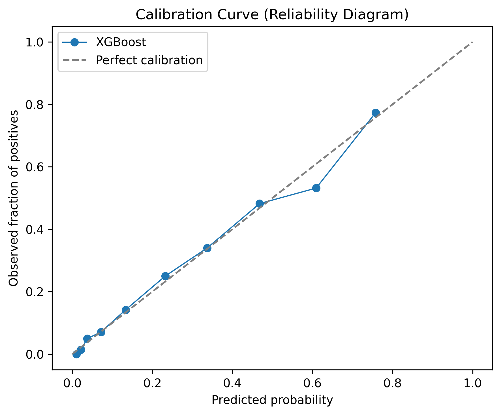

# Customer Churn Prediction + Retention Targeting (Telco)

**TL;DR** — Telco churn prediction with **XGBoost** (ROC-AUC 0.85, PR-AUC 0.68). Data from **Google Cloud BigQuery** or local CSV; threshold-based retention policies with precision/recall. Python, scikit-learn, XGBoost, BigQuery.

---

## What I did

- **Data:** Built a dual-source pipeline — queried and loaded data via **SQL in Google Cloud BigQuery**, with a pandas backup for local CSV/Excel; config-driven switch (`DATA_SOURCE`).
- **ML pipeline:** Implemented stratified train/validation/test splits, training-set-only scaling (no leakage), and **grid-search hyperparameter tuning** for Logistic Regression and XGBoost.
- **Evaluation:** Compared baseline vs tuned models using **ROC-AUC**, **PR-AUC**, and **Brier score** (probability calibration); emphasized PR-AUC for imbalanced churn.
- **Business output:** Translated model scores into **actionable threshold policies** (e.g. top 10% highest-risk) with precision/recall/F1 and confusion matrices; added an **interpretability** view via logistic regression coefficients.

---

## Results

### Model Comparison

| Model | ROC-AUC | PR-AUC | Brier | Top 10% precision | Summary |
|---|---:|---:|---:|---:|---|
| Logistic Regression (baseline) | **0.8498** | **0.6461** | – | 0.752 | Strong interpretable baseline |
| Logistic Regression (tuned) | 0.8494 | 0.6453 | 0.1354 | 0.752 | Similar to baseline |
| **XGBoost (tuned)** | **0.8548** | **0.6773** | **0.1326** | **0.773** | **Best overall** |

*Test set; data from BigQuery.*

**Selected model: XGBoost (tuned)** — Best PR-AUC, ROC-AUC, and calibration. vs Logistic baseline: **+0.005 ROC-AUC**, **+0.031 PR-AUC**.

> PR-AUC is emphasized for imbalanced churn; it is more informative than accuracy for identifying churners.

---

## Test Curves (XGBoost)

<p align="center">
  <a href="reports/figures/xgboost_pr_curve.png"></a>
  <a href="reports/figures/xgboost_roc_curve.png"></a>
</p>
<p align="center">
  <a href="reports/figures/xgboost_calibration_curve.png"></a>
</p>

---

## Operating Points (XGBoost, Test Set)

Thresholds trade off **coverage** (who you contact) vs **precision/recall** (who actually churns).

| Policy | Threshold | Target Rate | Precision | Recall | F1 |
|---|---:|---:|---:|---:|---:|
| Default 0.5 | 0.5000 | 22.71% | 0.6313 | 0.5401 | 0.5821 |
| Top 5% | 0.7541 | 5.04% | **0.8592** | 0.1631 | 0.2742 |
| Top 10% | 0.6841 | 10.01% | **0.7730** | 0.2914 | 0.4233 |
| Top 20% | 0.5363 | 20.01% | 0.6525 | 0.4920 | 0.5610 |
| Top 30% | 0.3990 | 30.02% | 0.5957 | 0.6738 | **0.6324** |
| Best F1 (val-tuned) | 0.3615 | 32.43% | 0.5799 | **0.7086** | **0.6378** |

**Confusion matrices (examples):** 0.5 → `[[917,118],[172,202]]` · Top 10% → `[[1003,32],[265,109]]` · Best F1 → `[[843,192],[109,265]]`

**Use:** Top 5–10% when capacity is tight (high precision); top 20–30% for more coverage. Best F1 tuned on validation.

---

## Data & Models

- **Data:** **BigQuery** (primary) or local **CSV/Excel** (backup). Target: binary churn. Same preprocessing either way: stratified split, scaling from training set only, optional encoding/cleaning in backup loader. Switch via **`config.DATA_SOURCE`** (`"bigquery"` or `"pandas"`); all scripts use **`data_loading.load_data()`**.
- **Models:** **Logistic Regression** (baseline + tuned) for interpretability and coefficients (`results/variable_affect_churn.csv`). **XGBoost (tuned)** as final model (nonlinearity, interactions). Takeaways from logistic: tenure and contract length matter; fiber/electronic check vs support add-ons.

---

## Outputs & Structure

| Location | Contents |
|----------|----------|
| `results/performance_metrics.json` | All metrics, thresholds, confusion matrices |
| `results/best_*_params.json` | Best hyperparameters (logistic, XGBoost) |
| `results/variable_affect_churn.csv` | Logistic coefficients |
| `reports/figures/` | ROC, PR, calibration curves |

**Key paths:** `data/` (optional CSV/Excel) · `results/` · `reports/figures/` · `src/` (`config.py`, `data_loading.py`, `main_data_loading.py`, `backup_data_loading.py`, `*_hyperparamtuning.py`, `*_training_eval.py`) · `sql/` (optional) · `requirements.txt`. See repo for full tree.

---

## How to Run

```bash
pip install -r requirements.txt
```

- **BigQuery:** Create a GCP project, enable BigQuery API, and set up credentials (e.g. `gcloud auth application-default login` or a service account). In `src/main_data_loading.py` set `project`, `dataset`, `table` in the `load_from_bigquery(...)` call. In `src/config.py` set **`DATA_SOURCE = "bigquery"`**.
- **Local:** Put `Telco_customer_churn.csv` or `.xlsx` in `data/`; in `src/config.py` set **`DATA_SOURCE = "pandas"`**.

From project root (with `src` on path):

```bash
python -m src.logisticreg_hyperparmtuning    # optional
python -m src.xgboost_hyperparamtuning      # optional
python -m src.logisticreg_training_eval
python -m src.xgboost_training_eval
```

Artifacts → `results/` and `reports/figures/`.

---

### SQL analysis queries

Lightweight exploratory queries live in `sql/`. Use the shared runner in the repo root:

```bash
cd customer_churn_prediction
python ../scripts/run_sql.py 01_label_distribution
python ../scripts/run_sql.py 02_churn_by_segment
```

Outputs are saved to `reports/sql_reports/`.

---

## Tech Stack

Python · scikit-learn · XGBoost · pandas · **Google Cloud BigQuery (SQL)** · stratified train/val/test · grid-search tuning · ROC-AUC / PR-AUC / Brier (calibration) · precision–recall analysis
